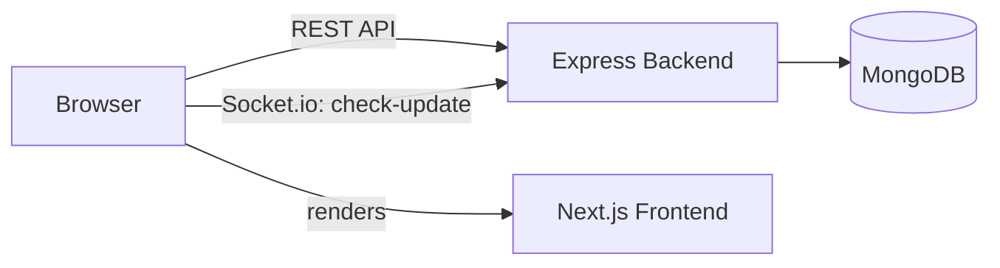

# Uptime Monitor

A full-stack uptime monitoring application. Register a URL, the backend pings it on a fixed interval, stores every result, and the frontend reflects live UP/DOWN status the moment a check completes — pushed over Socket.io, with no polling and no page refresh.

**Live demo:** [epifi-code.vercel.app](https://epifi-code.vercel.app/)
**Backend health check:** [epifi-code.onrender.com/health](https://epifi-code.onrender.com/health)
**Repository:** [github.com/KanishkYadav12/epifi-code](https://github.com/KanishkYadav12/epifi-code)

---

## Overview

The app is split into two independently deployable services sharing one MongoDB instance:

- **Backend** — Express + TypeScript. Pings every registered URL on a `setInterval` loop, records the status code, response time, and timestamp of each check, and emits the result over Socket.io as soon as it's saved.
- **Frontend** — Next.js (App Router) + TypeScript + Tailwind. Maintains a persistent Socket.io connection so every dashboard card updates live, and renders a Recharts line chart of recent response times per monitor.

## Architecture



The frontend talks to the backend over REST for CRUD operations — registering, listing, and deleting monitors — and keeps a Socket.io connection open in the background to receive `check-update` events the instant a new ping result lands, so the UI never needs to poll or refresh.

## Tech Stack

| Layer | Technology |
|---|---|
| Backend | Node.js, Express, TypeScript |
| Database | MongoDB (Mongoose) |
| Scheduler | `setInterval`, interval controlled by `CHECK_INTERVAL_MS` |
| HTTP pinging | Axios |
| Real-time | Socket.io |
| Frontend | Next.js (App Router), TypeScript, Tailwind CSS |
| Charts | Recharts |
| Containerization | Docker, Docker Compose |

## Project Structure

```
.
├── backend/             Express + TypeScript API, MongoDB models, scheduler, Socket.io server
├── frontend/             Next.js dashboard, Socket.io client, Recharts history chart
├── docker-compose.yml    Orchestrates mongo + backend + frontend with one command
├── .env                  Environment variables for all services
├── README.md
└── AI_LOG.md             AI collaboration log
```

## Getting Started

### Run locally with Docker (recommended)

```bash
git clone https://github.com/KanishkYadav12/epifi-code.git
cd epifi-code
docker compose up --build
```

- Frontend → http://localhost:3000
- Backend health check → http://localhost:4000/health

That's the entire setup — Docker Compose builds and starts MongoDB, the backend, and the frontend together, with the backend waiting for MongoDB to report healthy before it starts.

### Environment Variables

| Variable | Used by | Description |
|---|---|---|
| `MONGODB_URI` | backend | MongoDB connection string |
| `PORT` | backend | Port the API listens on (default `4000`) |
| `CHECK_INTERVAL_MS` | backend | How often monitors are pinged, in milliseconds (default `60000`) |
| `FRONTEND_URL` | backend | Allowed CORS origin |
| `NEXT_PUBLIC_API_URL` | frontend | Base URL for REST calls to the backend |
| `NEXT_PUBLIC_SOCKET_URL` | frontend | Socket.io server URL |

## Verifying It Works

1. Open the app — locally at `http://localhost:3000`, or the [live demo](https://epifi-code.vercel.app/)
2. Add a monitor — Name: `Example (Up)`, URL: `https://example.com`
3. Add a second monitor — Name: `Invalid (Down)`, URL: `https://this-domain-should-not-resolve-aiassignment-test.com`
4. Wait up to 60 seconds (the default check interval)
5. The first card turns green with a recorded response time — **UP**
6. The second card turns red — **DOWN**
7. Both updates appear live, with no manual refresh — confirming Socket.io is pushing real-time state rather than the frontend polling

## Deployment

The live demo above is deployed as two separate services — frontend on Vercel, backend on Render — sharing a managed MongoDB instance. Locally, the same setup runs as three containers via `docker compose up --build`.

### Deployment Sketch (illustrative only)

The note below sketches an alternative containerized deployment to AWS, separate from the Vercel/Render setup actually used for the live demo above. **This is a sketch only — not production-hardened**; no security-group, IAM, or TLS-termination detail is included, it's meant to communicate topology, not be applied as-is.

**Topology in plain English:** both services are built into Docker images, pushed to their own ECR repositories, and run as separate ECS Fargate services behind a single Application Load Balancer. The ALB routes `/api/*` and `/socket.io/*` to the backend target group and everything else to the frontend target group. MongoDB is replaced with a managed DocumentDB cluster (or MongoDB Atlas) rather than self-hosting Mongo on ECS, since a stateful database shouldn't live in an ephemeral container.

```hcl
# Illustrative only — not production-hardened

resource "aws_ecr_repository" "backend" {
  name = "uptime-monitor-backend"
}

resource "aws_ecr_repository" "frontend" {
  name = "uptime-monitor-frontend"
}

resource "aws_ecs_cluster" "main" {
  name = "uptime-monitor-cluster"
}

resource "aws_ecs_task_definition" "backend" {
  family                   = "uptime-monitor-backend"
  requires_compatibilities = ["FARGATE"]
  network_mode             = "awsvpc"
  cpu                      = 256
  memory                   = 512

  container_definitions = jsonencode([{
    name  = "backend"
    image = aws_ecr_repository.backend.repository_url
    portMappings = [{ containerPort = 4000 }]
    environment = [
      { name = "MONGODB_URI", value = var.documentdb_connection_string },
      { name = "FRONTEND_URL", value = var.frontend_url }
    ]
  }])
}

resource "aws_ecs_task_definition" "frontend" {
  family                   = "uptime-monitor-frontend"
  requires_compatibilities = ["FARGATE"]
  network_mode             = "awsvpc"
  cpu                      = 256
  memory                   = 512

  container_definitions = jsonencode([{
    name  = "frontend"
    image = aws_ecr_repository.frontend.repository_url
    portMappings = [{ containerPort = 3000 }]
  }])
}

resource "aws_ecs_service" "backend" {
  name            = "backend-service"
  cluster         = aws_ecs_cluster.main.id
  task_definition = aws_ecs_task_definition.backend.arn
  desired_count   = 1
  launch_type     = "FARGATE"
}

resource "aws_ecs_service" "frontend" {
  name            = "frontend-service"
  cluster         = aws_ecs_cluster.main.id
  task_definition = aws_ecs_task_definition.frontend.arn
  desired_count   = 1
  launch_type     = "FARGATE"
}

resource "aws_lb" "main" {
  name               = "uptime-monitor-alb"
  load_balancer_type = "application"
  subnets            = var.public_subnet_ids
}

# Listener rules: /api/* and /socket.io/* -> backend target group,
# everything else -> frontend target group.
```

## AI Collaboration

This project was built with substantial AI assistance — see [`AI_LOG.md`](./AI_LOG.md) for the full breakdown of tools used, the prompts that shipped each phase, and a real instance where the AI got something wrong and how it was corrected.

## Author

**Kanishk Yadav**
[GitHub](https://github.com/KanishkYadav12) · [LinkedIn](https://linkedin.com/in/kanishk-yadav-sde)
